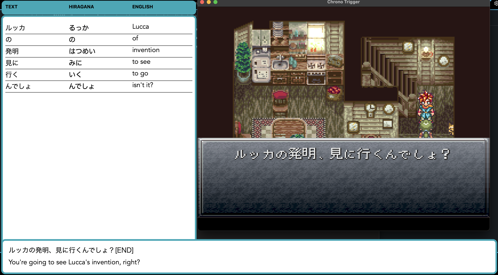

# Learn Japanese Overlay

A macOS overlay window for learning Japanese. Right now it supports the snes chrono trigger game.

The idea is to be able to capture the text from the game using OCR, I have preprocessed the game scripts to get the translations and I have use a TTS library to generate the audio, for each phrase of the game. (the reason for the preprocessed scripts is that the OCR is not 100% accurate.)

You get the orignal text in Japanese, the translated text in English, the word by word hiragana and english translation, and also you can play the audio.

I used OpenEMU, place the window in the "hole", play normally, hit `T` to translate the text, it will show the translation in the overlay, also if you want, hit `P` to play the audio.

For the scripts I used the retranslations from the Chrono Compendium https://www.chronocompendium.com/Term/Retranslation.html



## Setup
```bash
python3.10 -m venv .venv
source .venv/bin/activate
pip install -r requirements.txt
python app.py
```

## Run the app
```bash
source .venv/bin/activate
python app.py
```
After running the app open OpenEMU and put it at the right of the screen.

## Instructions
The overlay is prepared to capture the text only of the bottom screen of the SNES. (make sure to move the text down before capturing)

- Press `T` to translate the text.
- And after the translation is done, press `P` to play the audio.

## Troubleshooting
If the translation is not working, check the screenshot.png file, it has to show the game text box.

## Generate game scripts and audio (not necessary to run, already generated)
This will generate the scripts and audio for the game. The dictionary and the audios can take lots of time, and you need to have the API keys for OpenAI.

I had to run this on a linux machine because the TTS library was not working on macOS.
```bash
sudo dnf install git python39-devel.x86_64 python39.x86_64 gcc.x86_64  gcc-c++.x86_64 libsndfile.x86_64  -y
cd games/snes/chrono_trigger/scripts
python3.9 -m venv .venv
source .venv/bin/activate
python -m pip install --upgrade pip
pip install -r requirements.txt
python -m unidic download

export OPENAI_API_KEY="your-api-key"
python gen.py
```
